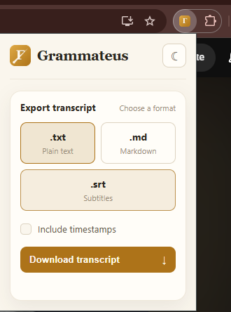
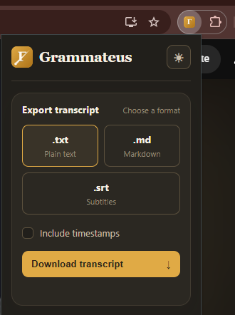

# Grammateus

Chrome extension that downloads YouTube transcripts as `.txt`, `.md`, or `.srt`.

 

## Why

Most transcript downloaders out there are either paywalled or flaky. Built this instead.

## Install

Not on the Web Store. Load it unpacked:

1. Clone this repo
2. `chrome://extensions` → enable Developer mode
3. Load unpacked → select the folder

## Use

Open a video, click the icon, pick a format, click download.


## Formats

- `.txt` / `.md` — plain transcript, optional timestamps
- `.srt` — real subtitles. If you've ever downloaded a video with IDM and wanted subs to go with it, this is that.

## How it works

YouTube gates caption URLs behind a PoToken now (empty response otherwise). Workaround: ask YouTube's InnerTube API for the video as the ANDROID client instead of WEB — its caption URLs aren't gated. Same trick `yt-dlp` uses.

Content script only runs when you click download, not on every video load. Re-injects itself each time since Chrome doesn't re-inject content scripts into tabs that were already open when the extension reloads.

## Structure

```
grammateus/
├── manifest.json
├── content_scripts/extractor.js   # fetches transcript via InnerTube
├── lib/format.js                   # events -> txt/md/srt
└── popup/                          # ui
```

## License

MIT. See [LICENSE](LICENSE).
